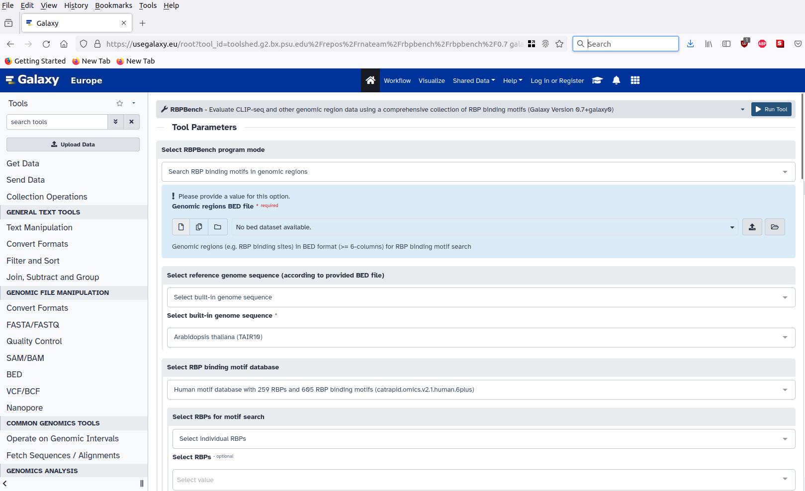
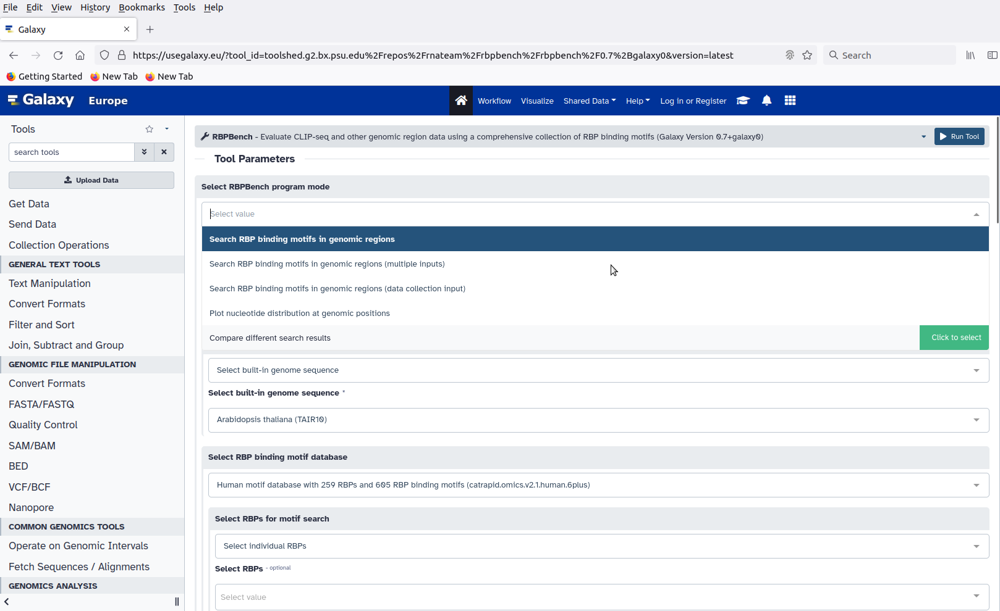

# RBPBench user interface introduction

RBPBench is intended to be primarily used as a tool within Galaxy.

## Introduction to Galaxy

If you are not familiar with the Galaxy ecosystem, please follow the  tutorials below and familiarize yourself with the Galaxy user interface and tools.

- [A gentle introduction to the Galaxy user interface](https://usegalaxy.eu/tours/core.galaxy_ui)
- [Galaxy history introduction](https://usegalaxy.eu/tours/core.history)
- [Using Galaxy and Managing your Data](https://training.galaxyproject.org/training-material/topics/galaxy-interface/)
- [Additional Galaxy training materials](https://training.galaxyproject.org/)
- [Additional Galaxy interactive tours](https://usegalaxy.eu/tours)

## Introduction to RBPBench user interface

Figure above shows RBPBench user interface. Here users can select the progam mode, upload genomic regions of interest (ROI) as BED formatted files and either upload a custom reference genome sequence or use one of the built-in reference sequences.

### Program modes

Figure above shows various run modes available in RBPBench. A brief description of these modes are given below:

#### Search RBP binding motifs

There are **three** search modes in RBPBench

1. **Search RBP binding motifs in genomic regions**

    Given a single set of binding regions (in BED format), search for motifs from multiple RBPs.

2. **Search RBP binding motifs in genomic regions (multiple inputs)**

    Given two or more sets of binding regions (in BED format), search for motifs from multiple RBPs.

3. **Search RBP binding motifs in genomic regions (data collection input)**

    This search mode is identical to the previous mode to use multiple binding regions. The difference being that an additional data description table with such meta information such as RBP, method ID, data ID and file name to be uploaded along with the input data.
    Example table format:

    | RBP | method          | data ID     | file name       |
    |-----|-----------------|-------------|-----------------|
    | PUM1| analysis_method1| PUM1_method1| PUM1_method1.bed|
    | PUM1| analysis_method2| PUM1_method2| PUM1_method2.bed|
    | PUM2| analysis_method1| PUM2_method1| PUM2_method1.bed|
    | PUM2| analysis_method2| PUM2_method2| PUM2_method2.bed|

#### Compare different search results

This mode is used to compare different motif search results (produced by any of the three motif search modes described above)

#### Plot nucleotide distribution at genomic positions

Given a set of genomic regions, center the regions around a user specified nucleotide position,  extend upstream and downstream of all regions by a given length and plot nucleotide distribution.
