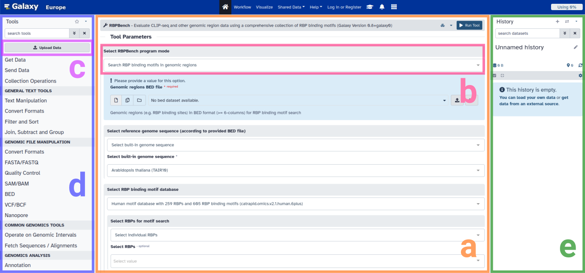
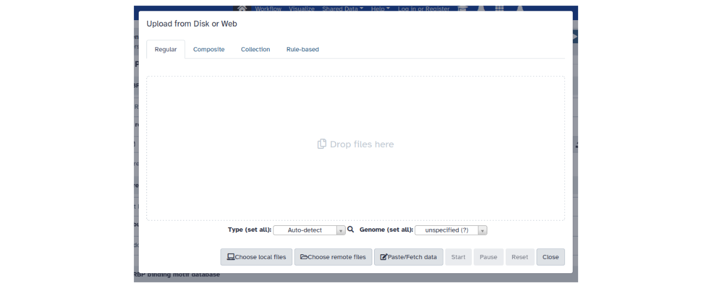
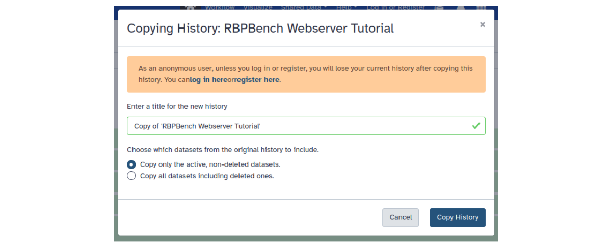
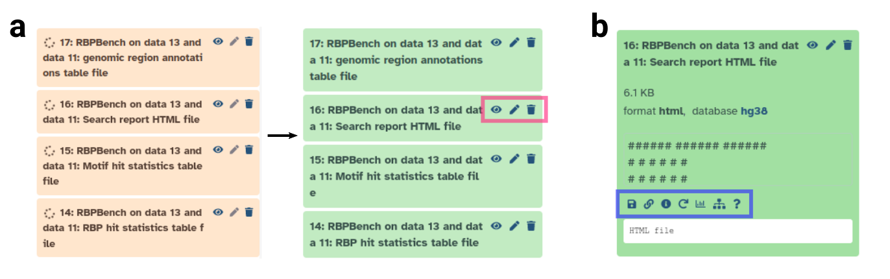

# Webserver Tutorial

This short tutorial provides a quick overview on how to use the [RBPBench webserver](https://usegalaxy.eu/root?tool_id=toolshed.g2.bx.psu.edu/repos/rnateam/rbpbench/rbpbench/0.8.1+galaxy0) 
on Galaxy, including some real data usage examples.

## Introduction

### Orientation

The webserver page is structured the following:

**Figure**: Webserver page overview.
**a**: RBPBench tool mask.
**b**: RBPBench program mode selection.
**c**: Data upload button.
**d**: Tool search and selection.
**e**: Current history, listing all input and output data.

In the main window we have the RBPBench tool mask (**a**), where we can select which program mode to run (**b**), 
specify input files as well as mode-associated parameters, and run RBPBench in the selected mode.
On the left side, we can upload the data (**c**) we want to process and analyse, as well as search for 
and select other tools (**d**) which are also running on the same Galaxy instance (*UseGalaxy.eu*).
Single tools can further be connected to construct comprehensive data analysis workflows (more information [here](https://training.galaxyproject.org/training-material/topics/galaxy-interface/tutorials/workflow-editor/tutorial.html)).
Uploaded data as well as the tool output data are shown in the history (**e**). 
Once a dataset is in the history, it becomes selectable by the tool.
For unregistered users, the history and the data it contains will be accessible 
for the extent of the browser session (using a cookie to identify your data, so as long as the cookie exists). 
Registered users (registration is free) further benefit from increased storage space, 
as well as the possibility to store, manage and share their histories and datasets within. 

### Program modes

For RBPBench, there are five different program modes to choose from:

1) Search RBP binding motifs in genomic regions
2) Search RBP binding motifs in genomic regions (multiple inputs)
3) Search RBP binding motifs in genomic regions (data collection input)
4) Plot nucleotide distribution at genomic positions
5) Compare different search results

More details on the respective modes can be found in the help section, at the bottom of the RBPBench tool mask.

### Uploading data

There are several ways of getting data into Galaxy. Typically this is done via the **upload data window** 
(click on *Upload data* button):

**Figure**: Data upload window.
Various options are available here (local or remote file upload, paste data or simply fetch/download given a URL, upload collections of files etc.).

Another neat way, especially for specific sets of data, is to **import a shared history**. A shared history comes with a URL, so 
all we have to do is to open the URL to import the history and its files into our history. 
We will use this option for the below usage examples, to quickly get all the files we need to run the examples.

## Usage examples

### Import example data

To get the example data, open the shared [example history link](https://usegalaxy.eu/u/michauhl/h/rbpbench-webserver-tutorial), 
and click on the *Import this history* button (upper left). This will open the history import window:

**Figure**: Import history window.

For this tutorial, we keep the history name 'RBPBench Webserver Tutorial' and 'Copy only active, non-deleted datasets'.
Click *Copy History* to import the data into our new history. Return to the RBPBench tool mask by clicking 
again on the [webserver link](https://usegalaxy.eu/root?tool_id=toolshed.g2.bx.psu.edu/repos/rnateam/rbpbench/rbpbench/0.8.1+galaxy0) or by typing 'rbpbench' into the *search tools* field and 
select RBPBench.

### Search RBP binding motifs in genomic regions

To search for RBP binding motifs in a given set of genomic regions, we select the program mode
*Search RBP binding motifs in genomic regions*. Here we need to provide a genomic regions file 
in BED format (*Genomic regions BED file*), as well as selecting a reference genome and the RBPs 
for motif search (*Select RBPs for motif search*).

#### PUM1 example

In the first example, we select eCLIP peak regions for the RBP PUM1 (`PUM1.k562_eclip.clipper_idr.bed`) 
from the history as *Genomic regions BED file*, 
the built-in human genome hg38 as reference genome (*Select built-in genome sequence* -> *Human Dec. 2013 (GRCh38/hg38) (hg38)*), 
and for search (*Select RBPs*) the following RBPs: `PUM1`, `PUM2`, `RBFOX2`.
Moreover, to add genomic region annotations, we go to *HTML report options*
and choose `Homo_sapiens.GRCh38.110.gtf.gz` from the history as GTF file. Also, we would like to output
the genomic region annotations as a table file (*Output options* -> *Output genomic region annotations table file?*).
Click on *Run Tool* to start the job. Output files of this job will appear in the history. Running jobs are colored 
in beige, jobs with errors red, and finished jobs in green (see [FAQ](faq.md) for bug reports). Note that in general,
runs with many RBPs, many (or larger) input regions, and added GTF annotations can take a bit longer.

**Figure**: History item details.
**a**: History output files in beige (job running) and green (job finished). 
Clickable icons marked by pink rectangle: 
eye (show file content in main window), pencil (edit history item), trash can (delete history item).
**b**: Clicking on history item reveals further options. 
Inside blue rectangle (from left to right):
download file, copy link, dataset / run details, rerun tool with same settings, visualize, show related items, help.

Once the job is finished, we can inspect any of the output files by clicking on the respective eye icon. 
For example, we can open the HTML report (*Search report HTML file*), which gives us 
(depending on the run settings) various informative statistics and plots. 
In this case, we can see (HTML section: *RBP motif enrichment statistics*) that PUM1 motifs are enriched in higher-scoring input regions 
(see report for explanations on statistics), and that there is a significant co-occurrence of PUM1 and PUM2 motifs 
(HTML section: *RBP co-occurrences heat map*). As for the genomic region annotations, we can further see that PUM1 
binding motif containing regions tend to be in CDS regions (HTML section: *Region annotations per RBP*), 
although regions containing both PUM1 and PUM2 motifs (HTML section: *RBP combinations upset plot*) have similar amounts of
3'UTR and CDS regions (PUM2 is known to preferentially bind to 3'UTRs). Other outputs include table
files with comprehensive RBP and motif level hit statistics, as well as the table file we requested as output,
containing the genomic region annotations for each input region.

#### SLBP example

In the second example, we select eCLIP peak regions for the RBP SLBP (`SLBP.k562_eclip.clipper_idr.bed`), again the built-in hg38 genome, 
and choose *Select RBPs for motif search* -> *Select all 259 RBPs* to search with all database RBPs. 
Also, we would like to output 
the selected RBP motifs as sequence logos into a separate HTML file (*Output options* -> *Plot RBP motifs?*).
Once the job is finished, we again open the HTML report (*Search report HTML file*). 
As we can see, SLBP motifs are the most enriched of all RBPs in the input regions. 
The second HTML file (*Motif plots HTML file*) visualizes all selected motifs and reports their hit counts.

### Search RBP binding motifs in genomic regions (data collection input)

To process multiple genomic region files in one run, RBPBench offers search mode with *multiple inputs* 
or *data collection input*. In *multiple inputs* mode, each dataset has to be selected manually, while in 
*data collection input* we can provide a data collection of BED files and a table file which assigns 
RBPs for search to each BED file name in the dataset collection. The table file also contains 
data and method IDs for each RBP + file name combination, which are used to describe the combination 
and to define what datasets are compared later on in *Compare different search results* mode. 
The *data collection input* search mode thus allows us to easily conduct individual searches on a large number 
of input BED files in one run.

For this example, we select the program mode *Search RBP binding motifs in genomic regions (data collection input)* 
and choose as input the history dataset collection `Genomic Regions Dataset Collection`, as well as the 
table file `batch_search_table.txt` (*Provide batch processing table file*), plus again the built-in hg38 as 
reference genome. Once the job is finished, we can use the two output table files as input files 
for RBPBench's comparison mode (see next section).

### Compare different search results

RBPBench's comparison mode (*Compare different search results*) allows us to compare 
different search results based on set RBPs, method IDs, and data IDs. 
The mode can thus be used e.g. to make comparisons between different cell types, CLIP-seq protocols,
or to benchmark CLIP-seq peak calling methods.
For more information on how this works, see the help section at the bottom of the RBPBench tool mask.

In this example, we want to compare the search results from our last example (*data collection input*).
Here, through the `batch_search_table.txt` table file, we defined two different comparisons 
based on motif hit statistics:

1) Compare four different peak calling methods on RBP PUM1
2) Compare two different cell types for RBP RBFOX2

For 1) we set different method IDs (`dewseq_w100_s5`, `clipper_idr`, `clipper_rep1`, `clipper_rep2`) to describe the peak calling methods / results, while keeping the data ID (`k562_eclip`) and RBP (`PUM1`) the same.
For 2) we set different data IDs (`hepg2_eclip`, `k562_eclip`), while keeping the method ID (`clipper_idr`) and RBP (`RBFOX2`) identical.

In *Compare different search results* mode, we thus select the two output files 
(RBP + motif hit statistics) from the previous *data collection input* run 
(press control + select the table files in the *Motif search results* window).
Once finished, we can inspect the HTML report file (*Comparison report HTML file*) to see the comparison results.
We note that the `dewseq_w100_s5` has the most motif hits per 1000 nt called peak region.
As for the second comparison, we can see that the eCLIP dataset from the HepG2 cell line (`hepg2_eclip`) 
in general contains more motif hits (absolute and percentage-wise), which e.g. might give us hints
regarding the quality of the experimental data.
