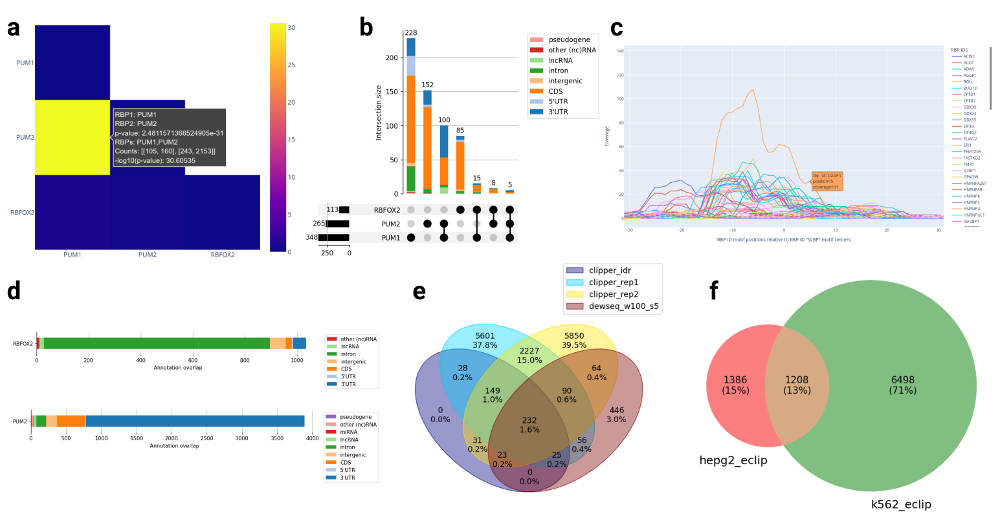

# Welcome to RBPBench!

RBPBench is multi-function tool to evaluate CLIP-seq and other genomic region data 
using a comprehensive collection of known RNA-binding protein (RBP) binding motifs. 
RBPBench can be used for a variety of purposes, from RBP motif search (database or 
user-supplied RBPs) in genomic regions, over motif co-occurrence analysis, 
to benchmarking CLIP-seq peak caller methods as well as comparisons across 
cell types and CLIP-seq protocols.

```{toctree}
:hidden:
:maxdepth: 1

docs/webserver_tutorial.md
docs/motif_database.md
docs/documentation.md
docs/faq.md
```

[Run RBPBench online](https://usegalaxy.eu/root?tool_id=toolshed.g2.bx.psu.edu/repos/rnateam/rbpbench/rbpbench/0.8+galaxy0)

[Webserver Tutorial](docs/webserver_tutorial.md)

[GitHub repository](https://github.com/michauhl/RBPBench)



<span style="font-size: 90%;">
**Figure**: Some example visualizations produced by RBPBench. 
**a**: RBP binding motif co-occurrence heat map. 
**b**: What RBP binding motif combinations appear in the data. 
**c**: Motif distances in the data relative to an RBP of interest. 
**d**: To which region types RBPs preferentially bind to. 
**e**: Comparing CLIP-seq peak calling methods. 
**f**: Comparing experimental conditions.
</span>
